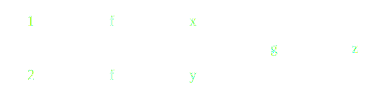

Background: Task scheduling
===========================

Dask is a task scheduler that satisfies the following adjectives:

*  Supports dependencies
*  Dynamic
*  Distributed and Centralized
*  Asynchronous and Event Driven
*  Efficient

This section sets up the context of these and relates where Dask's choices fit
in.

Dependencies
------------

Dask is a task scheduler *with data dependencies*.  This means that it manages
graphs of tasks that depend on one another, and farms out these tasks to a set
of available workers.  For example consider the following computation:

.. code-block:: python

   x = e.submit(f, 1)
   y = e.submit(f, 2)
   z = e.submit(g, x, y)

This computation consists of three *tasks*, ``x = f(1)``, ``y = f(2)`` and ``z
= g(x, y)``.  A **task** is a function evaluated on data.  Some of these tasks
can be run in parallel, notably the two evaluations of ``f``.  The task ``g(x,
y)`` must wait until both ``x`` and ``y`` are available in memory.  The task
``z`` *depends on* ``x`` and ``y``.

A task scheduler is any system which consumes information like this graph,
combines it with some computational infrastructure (like a network of
computers) and produces a credible output for ``z``.

Task scheduling *without dependencies* is also a rich topic, especially in
allocating resources for many jobs of varying sizes, such as occurs on
super-computer allocation queues.  It involves various heuristics to pack jobs
tightly while also ensuring fairness and reducing global metrics of
time-to-completion.  Because this is a special case of task scheduling with
dependencies we *will consider this*, but a bit later on.

Dynamic
-------

There are several interesting choices to consider when deciding how to evaluate
this graph.  If our computational cluster consists of two computers then we
might choose to exploit the parallelism inherent in the graph and evaluate ``x
= f(1)`` on one computer and ``y = f(2)`` on the other.  When we evaluate
``z = g(x, y)`` we must move both ``x`` and ``y`` to a single computer.  We
might make this choice based on several considerations

*  We might choose to move the smaller of ``x`` and ``y`` to save on data
   communication costs
*  We might choose the worker that is least occupied to spread computational
   costs
*  We might choose the worker with the most available RAM to spread around
   storage costs
*  If ``f`` is very fast then it may be faster to run all three computations
   on only one computer or to rerun one of the computations on the other
   computer if it has already been run.
*  The function ``g`` may need special hardware, such as a GPU or
   database connection, available on only one of the machines.
*  We may choose to move the first value to complete, regardless of data size,
   in hopes of overlapping communication and computation time.

These are the sorts of questions that a task scheduler considers in its daily
routine of deciding when and where to run functions.

To help the scheduler make these decisions may have information about expected
runtimes of ``f`` and ``g`` on all of the available hardware (which may be
heterogenous), expected sizes of ``x`` and ``y``, communication bandwidths and
latencies between all pairs of computers, etc..  If given perfect information
about runtimes and storage and communication bandwidths then it is possible to
find an optimal solution that minimizes total runtime.  However it has been
shown that finding this optimal solution is an NP-Hard problem and so can be
quite costly.  Approximate solutions exist.

We may choose to determine the schedule of what tasks to run where either
statically before we begin computation, or dynamically as the computation is
running.

Static scheduling is typically used in cases where we have both a lot
of information about expected times and when we intend to rerun the same
computation several times, and so are willing to spend a long time finding an
optimal schedule.  This is the case when making specialized hardware, such as
video encoders, or even when optimizing production in physical factories.

Dynamic scheduling is typically used where we have less information up front,
and so prefer to respond dynamically as tasks complete.  Because dynamic
solutions typically have less information they optimize less, and so are
faster.  However because they operate at runtime their scheduling costs can
become significant.  Dynamic systems are also useful for resilience, when
workers may die unexpectedly or otherwise suffer performance degredation.

Dask is a *dynamic* task scheduler, it schedules individual tasks quickly (in
under a millisecond) and does not take expected runtimes or memory footprints
as inputs.  However it does collect runtime information and use this to more
intelligently schedule future tasks, making some assumptions about runtime
similarity of related tasks.

Distributed
-----------

The scheduler allocates tasks to run on workers.  These workers may be other
threads in the same process, or other machines running on different computers.

In the case of threads in the same process all workers *share memory* and so
communication of results between workers is free, eliminating a great deal of
concern and necessary technology.

In the case of workers running on different computers data *must be passed*
between workers.  This can be costly both because we need to serialize data
into bytes that can be put on a wire, and because inter-node bandwidths
(100MB/s to 1000MB/s) tend to be much worse than memory transfers (infinite).
Avoiding data transfer ends up being a central goal of many computationally
minded task schedulers.  Tracking which data is where, how large it is, and how
best to allocate tasks ends up increasing the amount of logic and necessary
state considerably.

The original Dask task scheduler is a single-machine shared-memory task
scheduler.  Howver this document largely concerns itself with the
*distributed-memory* task scheduler found in ``dask.distributed``.

Additionally, Dask is *centralized*, meaning that it has a single central
Scheduler node, that makes most of the decisions.  This limits is scale to
1000's of computers and introduces a single point of failure.  These
limitations are typically fine for an important class of common workloads.
This is the approach taken by most well-known distributed systems like
databases, Spark, etc..

Asynchronous and Event Driven
-----------------------------

The task graph within the scheduler can grow or shrink based on external
stimuli.  Workers can report that certain tasks have finished or were lost due
to failures.  Clients can dynamically extend the graph with new computations or
reduce the graph as they leave or become disinterested in certain results.  All
of these actions occur while tasks are being computed.  The scheduler responds
to stimuli and changes the administrative state of all known tasks, workers,
and clients so that at all points the system is aimed towards completing all
desired tasks and no more.

Efficient
---------

Many numeric computations are quite fast, measuring in the milliseconds even on
many megabytes of data.  In these cases we desire to keep scheduler overhead
low so that overhead doesn't overwhelm actual computation time.  We concern
ourselves both with asymptotic efficiency, and micro-performance.

Asymptotic Efficiency
~~~~~~~~~~~~~~~~~~~~~

As the graph grows large we become concerned about operations that might
traverse large sections in order to find the right task to run.  In order to
avoid poor performance under the very-many-tasks regime all state updates occur
in linear time, relative the number of dependency-edges that must be touched.
For example when a single worker's thread becomes available for a new task we
determine that next task in constant time.  When a worker fails we reallocate
all necessary tasks proportional to the number of data elements that were lost,
either becasue they were only on that worker or because they *must* be
recomputed to recompute the lost data.  At no point do we walk through the
entire graph, or even a logarthmic portion of the graph.

Micro Performance
~~~~~~~~~~~~~~~~~

The Dask scheduler is internally represented as a number of Python ``dict``,
``set``, ``list``, and ``bytes`` objects.  While Python is typically considered
a slow interpretted language this is typically because of how it is written,
with a hierarchy of fairly slow objects moving about.  The core data
structrures that make up the task scheduler are all very fast, typically
operating within 2-5x the speed of their C or Java equivalents.  These sorts of
lookups are significant enough that we tend to be more by data structure
implementation than by the costs of using an interpretted language.
Additionally, the scheduler compiles and can run under PyPy, the compiled
Python implementation.

The general guarantee is that the Dask task scheduler operates in under a
millsecond.  Typically it achieves overhead in the few hundreds of microseconds
in CPython with full latencies in the few milliseconds (depending on network).
